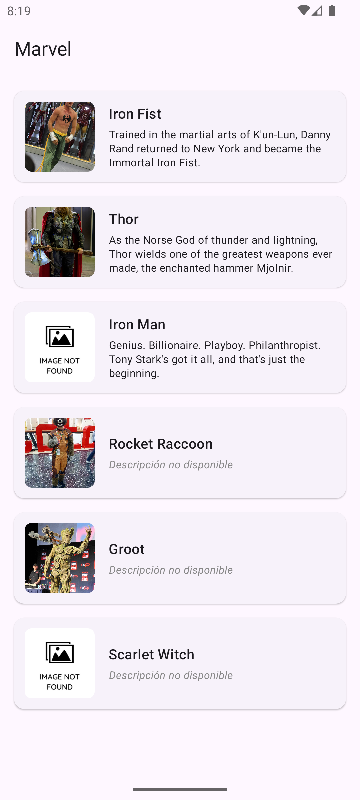
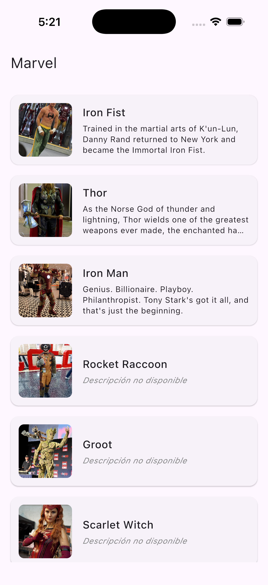

# MarvelKMP

Aplicación Kotlin Multiplatform (KMP) que muestra personajes del universo Marvel. Proyecto universitario desarrollado en la materia Taller de Programación — UNLAM.

## Screenshots

| Android | iOS |
|---|---|
|  |  |

## Nota sobre la API de Marvel

La API oficial de Marvel (`developer.marvel.com`) requiere autenticación mediante tres parámetros: `ts` (timestamp), `apikey` (clave pública) y `hash` (md5 del timestamp + clave privada + clave pública). Esta lógica está implementada en `KtorCharactersRepository` y `Md5.kt` con soporte nativo para Android y iOS.

Sin embargo, la API oficial **no está disponible** al momento de desarrollo. Como alternativa, se creó un JSON propio que replica exactamente la estructura de respuesta de la API real, servido desde:

```
https://raw.githubusercontent.com/AndresClz/MarvelKMP/main/mock/characters.json
```

El mock ignora los parámetros de autenticación, pero la implementación está lista para apuntar a la API real reemplazando `CHARACTERS_URL` en `Constants.kt` y completando `PUBLIC_KEY` y `PRIVATE_KEY`.

## ¿Qué hace?

- Lista personajes Marvel ordenados por relevancia
- Navega al detalle de cada personaje con imagen y descripción
- Persiste los datos en caché local para funcionar sin red
- Corre en Android e iOS desde una única base de código compartida

## Stack tecnológico

| Capa | Tecnología |
|---|---|
| UI | Compose Multiplatform 1.10.3 |
| Navegación | Voyager 2.2.21 + SlideTransition |
| Red | Ktor 3.1.3 |
| Serialización | Kotlin Serialization 1.8.1 |
| Caché | SQLDelight 2.3.2 |
| Imágenes | Kamel 1.0.9 |
| Logs | Napier 2.7.1 |
| ViewModel | AndroidX Lifecycle KMP 2.10.0 |

## Arquitectura

Clean Architecture + MVVM, con toda la capa de datos y dominio en `commonMain`.

```
commonMain/
├── data/
│   ├── dto/                  # DTOs @Serializable (respuesta de API)
│   ├── local/                # CacheCharactersRepository (SQLDelight)
│   ├── network/              # HttpClientFactory (Ktor)
│   └── repositories/         # KtorCharactersRepository
├── domain/
│   ├── Character.kt          # modelo de dominio
│   ├── CharactersRepository.kt
│   └── CharactersService.kt  # regla de ordenamiento
└── ui/
    └── screens/
        ├── home/
        │   ├── HomeScreen.kt
        │   └── HomeViewModel.kt
        └── detail/
            └── DetailScreen.kt
```

**Patrón de caché:** `CacheCharactersRepository` decora a `KtorCharactersRepository` — intenta la red primero, guarda en SQLDelight y sirve desde caché ante fallos.

**Navegación:** Voyager maneja el backstack. `HomeScreen` hace `navigator.push(DetailScreen(character))`; el botón Volver hace `navigator.pop()`. La transición slide derecha→izquierda es automática en ambas plataformas.

## Cómo correr

**Android** — macOS/Linux
```bash
./gradlew :composeApp:assembleDebug
```

**Android** — Windows
```bash
.\gradlew.bat :composeApp:assembleDebug
```

**iOS** — solo macOS  
Abrir `/iosApp` en Xcode y correr desde ahí, o usar la configuración de run en Android Studio con el plugin KMP.

**Tests**
```bash
./gradlew :composeApp:allTests
```
